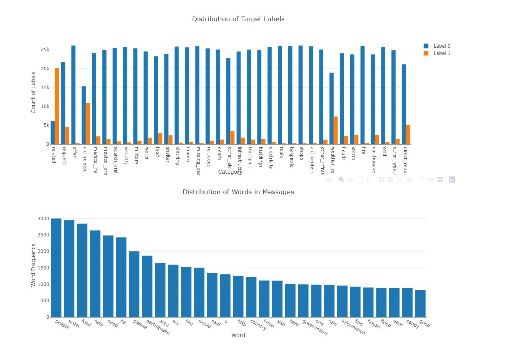

# Disaster Response Pipeline Project

## Table of Contents
1. [Instructions](#description)
2. [Getting Started](#getting_started)
3. [File Description](#file_desc)
4. [License](#license)
5. [Acknowledgement](#acknowledgement)
6. [Webapp](#screenshots)

### Instructions:
1. Run the following commands in the project's root directory to set up your database and model.

    - To run ETL pipeline that cleans data and stores in database
        `python data/process_data.py data/disaster_messages.csv data/disaster_categories.csv data/DisasterResponse.db`
    - To run ML pipeline that trains classifier and saves
        `python models/train_classifier.py data/DisasterResponse.db models/classifier.pkl`

2. Run the following command in the app's directory to run your web app.
    `python run.py`

3. Go to http://0.0.0.0:3001/

### Getting Started:
Install in the following order and try to run above steps in Instructions.

1. pip install --upgrade pip 
2. pip3 install https://github.com/explosion/spacy-models/releases/download/en_core_web_sm-2.2.0/en_core_web_sm-2.2.0.tar.gz (for word embeddings)
3. pip install -r requirements.txt

### File Description
1. app folder contains the flask app and templates to run the webapp
2. models folder contains train_classifier.py to get the ML model
3. data folder contains datasets and process_data.py for ETL
4. Dataset contains pre-labelled tweet and messages from real-life disaster events from Figure Eight (now Appen)

## License

## Acknowledgements
* [Figure Eight](https://www.figure-eight.com/) for providing the relevant dataset to train the model

## Webapp

1. Distribution of labels in target categories and distribution of words in messages

